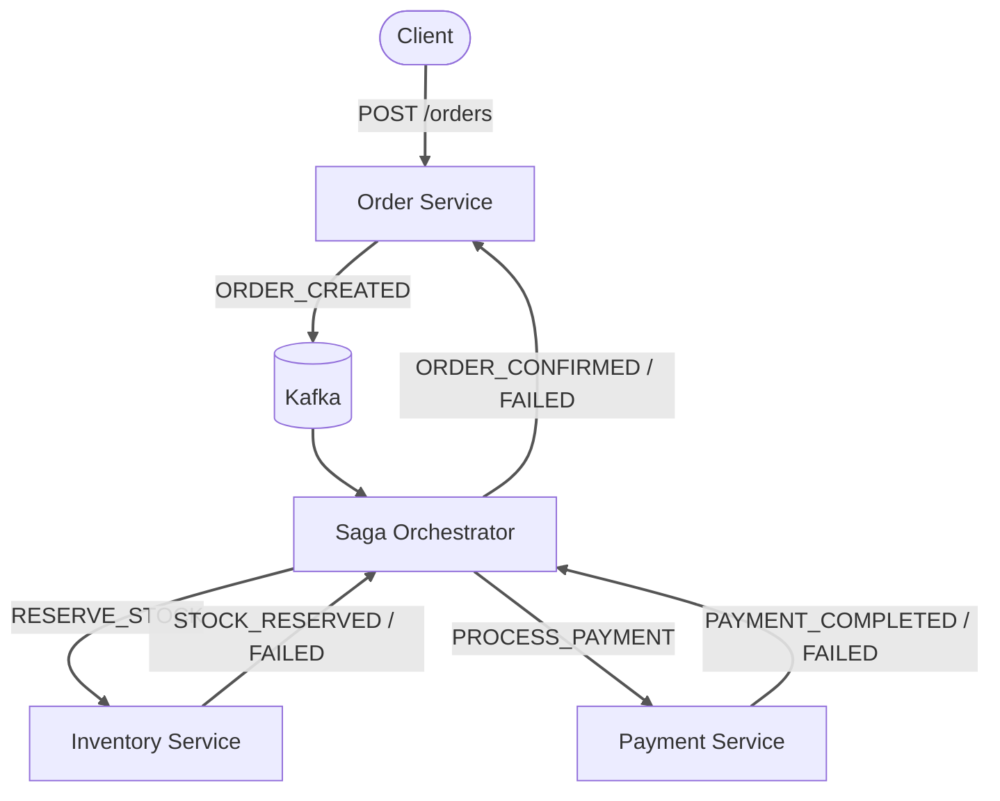
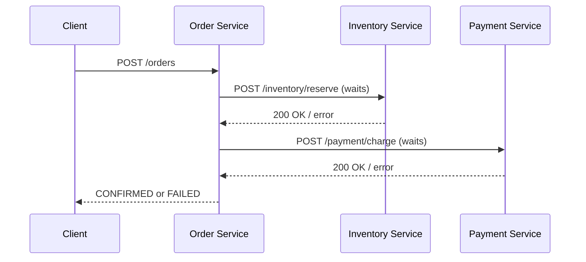
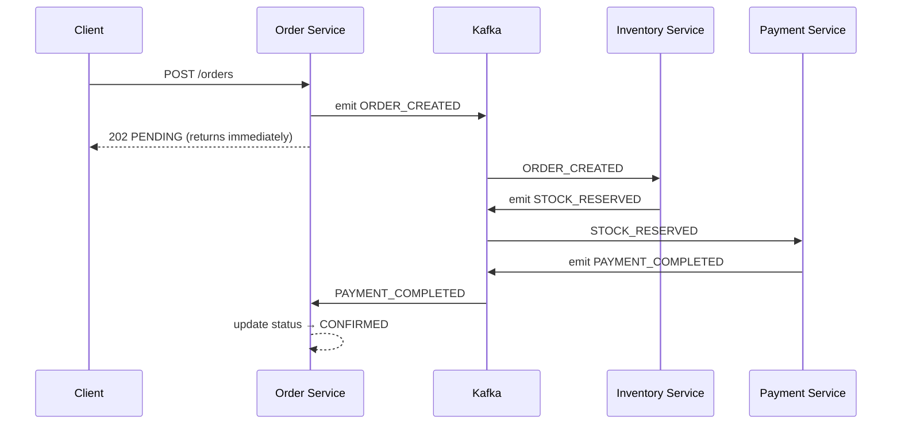
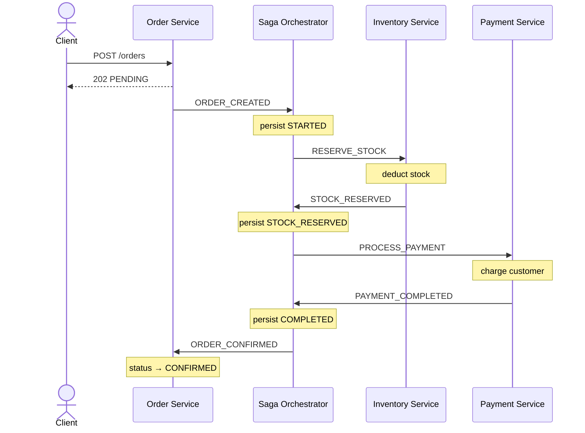
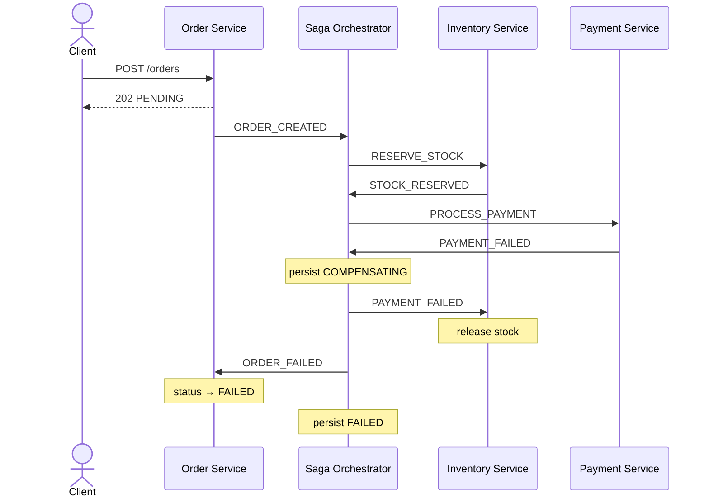
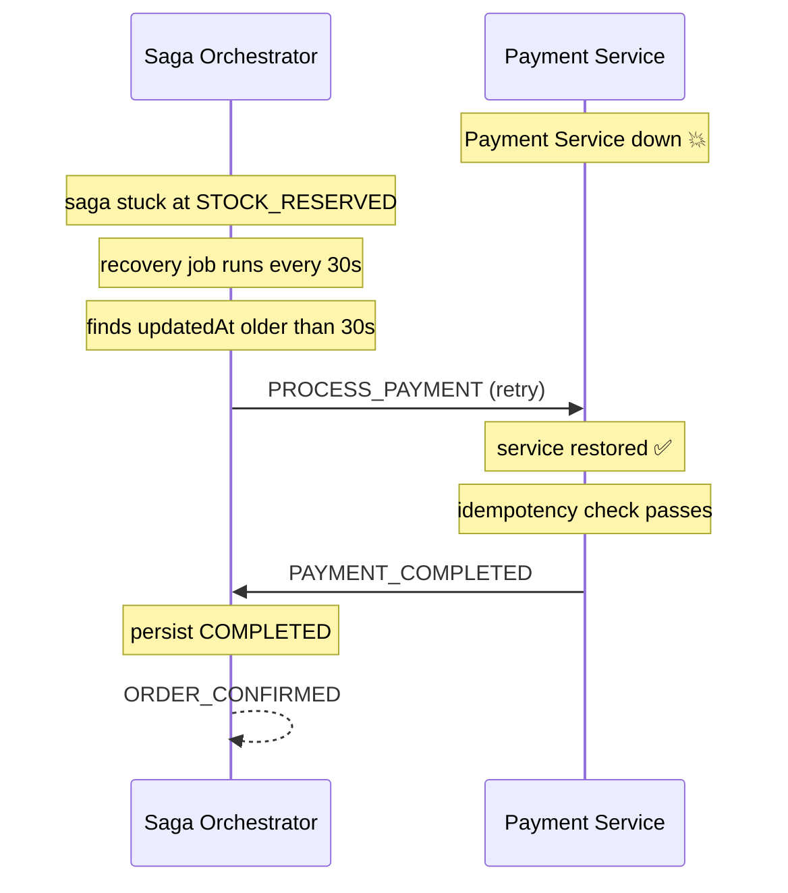

# Distributed Order Processing System

A NestJS microservices project built in three phases to learn and showcase real-world distributed systems patterns — from naive HTTP coupling all the way to saga orchestration with crash recovery.

Each phase lives in its own branch so you can see exactly how the architecture evolved and _why_ each change was made.

---

## Branches

| Phase   | Branch                                                                                                                              | What It Demonstrates                         |
| ------- | ----------------------------------------------------------------------------------------------------------------------------------- | -------------------------------------------- |
| Phase 1 | [`phase/1-http-synchronous`](https://github.com/mahmoodiftee/Distributed-Order-Processing-System/tree/phase/1-http-synchronous)     | Raw service-to-service HTTP communication    |
| Phase 2 | [`phase/2-kafka-async`](https://github.com/mahmoodiftee/Distributed-Order-Processing-System/tree/phase/2-kafka-async)               | Decoupling with Kafka + idempotent consumers |
| Phase 3 | [`phase/3-saga-orchestration`](https://github.com/mahmoodiftee/Distributed-Order-Processing-System/tree/phase/3-saga-orchestration) | Saga orchestration + crash recovery          |

---

## Why This Project Exists

Most microservices tutorials show you the happy path. This project was built to understand what happens when things go wrong — services go down, messages arrive twice, transactions crash halfway through. Each phase introduces a real problem and solves it with a real pattern.

---

## Architecture Overview



Each service owns its own PostgreSQL database. No service ever reads or writes another service's database directly.

---

## Services

| Service           | Port | Database Port | Responsibility                       |
| ----------------- | ---- | ------------- | ------------------------------------ |
| Order Service     | 3001 | 5432          | Creates and tracks orders            |
| Inventory Service | 3002 | 5433          | Manages product stock                |
| Payment Service   | 3003 | 5434          | Processes payments                   |
| Saga Orchestrator | 3004 | 5435          | Coordinates distributed transactions |

---

## Tech Stack

- **NestJS** — structured, decorator-based Node.js framework
- **Prisma** — type-safe database client
- **PostgreSQL** — one separate instance per service
- **Kafka** — async event bus between services
- **Docker Compose** — local infrastructure
- **pnpm workspaces** — monorepo management

---

## Phase 1 — HTTP Synchronous

> Branch: [`phase/1-http-synchronous`](https://github.com/mahmoodiftee/Distributed-Order-Processing-System/tree/phase/1-http-synchronous)

Services call each other directly over HTTP. Simple to understand but tightly coupled — if any service is down, the entire order fails instantly.



**The problem this reveals:** One service going down takes the whole flow down with it. This is the pain point that Phase 2 solves.

---

## Phase 2 — Kafka Async + Idempotency

> Branch: [`phase/2-kafka-async`](https://github.com/mahmoodiftee/Distributed-Order-Processing-System/tree/phase/2-kafka-async)

Services communicate through Kafka events instead of direct HTTP calls. Order Service emits an event and walks away — it doesn't wait, it doesn't care if Inventory Service is running right now.



Idempotent consumers are added to every service so duplicate Kafka messages are silently ignored — making multiple identical events have the same effect as a single one.

**The problem this reveals:** What happens if the service crashes mid-transaction? Stock gets reserved but payment never happens. Order is stuck forever. This is the pain point Phase 3 solves.

---

## Phase 3 — Saga Orchestration + Crash Recovery

> Branch: [`phase/3-saga-orchestration`](https://github.com/mahmoodiftee/Distributed-Order-Processing-System/tree/phase/3-saga-orchestration)

A dedicated Saga Orchestrator coordinates the full transaction. It is the only service that makes decisions — Inventory and Payment are pure workers that receive commands and report results. Before every step the Saga persists its state to the database so it can recover from any crash.

**Happy path:**



**Failure path — compensation:**



**Recovery path — service was down:**



**The problem this solves:** In Phase 2 a crashed service left orders stuck forever with no recovery. Now every stuck transaction is detected and either retried or compensated automatically.

---

## Kafka Topics

| Topic               | Producer          | Consumer                             | Purpose                     |
| ------------------- | ----------------- | ------------------------------------ | --------------------------- |
| `order.created`     | Order Service     | Saga Orchestrator                    | New order placed            |
| `reserve.stock`     | Saga Orchestrator | Inventory Service                    | Command to reserve stock    |
| `stock.reserved`    | Inventory Service | Saga Orchestrator                    | Stock reserved successfully |
| `stock.failed`      | Inventory Service | Saga Orchestrator                    | Stock reservation failed    |
| `process.payment`   | Saga Orchestrator | Payment Service                      | Command to process payment  |
| `payment.completed` | Payment Service   | Saga Orchestrator                    | Payment successful          |
| `payment.failed`    | Payment Service   | Saga Orchestrator, Inventory Service | Payment failed              |
| `order.confirmed`   | Saga Orchestrator | Order Service                        | Mark order confirmed        |
| `order.failed`      | Saga Orchestrator | Order Service                        | Mark order failed           |

---

## Running Locally

**Prerequisites:** Node.js 18+, pnpm, Docker Desktop

```bash
# Clone and install
git clone https://github.com/mahmoodiftee/Distributed-Order-Processing-System.git
cd Distributed-Order-Processing-System
pnpm install

# Start infrastructure
docker compose up -d

# Start all services (4 separate terminals)
pnpm --filter order-service dev
pnpm --filter inventory-service dev
pnpm --filter payment-service dev
pnpm --filter saga-orchestrator dev
```

**Place an order:**

```bash
curl -X POST http://localhost:3001/orders \
  -H "Content-Type: application/json" \
  -d '{
    "customerId": "customer-1",
    "productId": "product-1",
    "quantity": 1,
    "totalAmount": 999.99
  }'
```

**Poll order status:**

```bash
curl http://localhost:3001/orders/<orderId>
```

---

## What I Learned Building This

**Tight coupling is invisible until it hurts.** Building Phase 1 first made the Kafka refactor feel necessary rather than over-engineered. You understand a solution better when you've felt the problem.

**Idempotency is not optional in distributed systems.** Kafka's at-least-once delivery means your consumers will receive duplicates. Every consumer must be safe to call multiple times with the same input.

**Crash recovery requires writing state before acting.** Write your intent to durable storage before executing it — then recovery is always possible.

**The saga pattern is not about the happy path.** Any system can handle success. The saga's value is entirely in its compensation and recovery logic. That's where the real engineering lives.

---

## What This Is Not

This is a learning implementation of production patterns, not a production system. A production deployment would additionally require Kubernetes with multiple replicas, a Kafka cluster with 3+ brokers, distributed tracing, centralized logging, metrics and alerting, and service-to-service authentication. The patterns are real. The infrastructure is local dev. Understanding the difference is part of the lesson.
