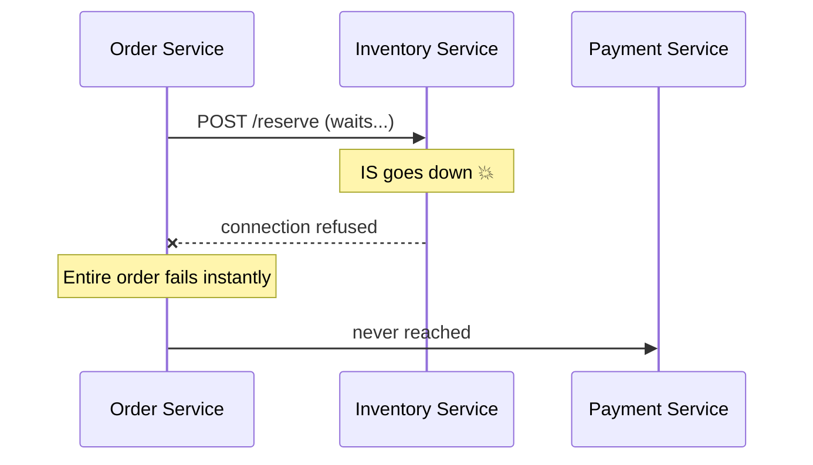
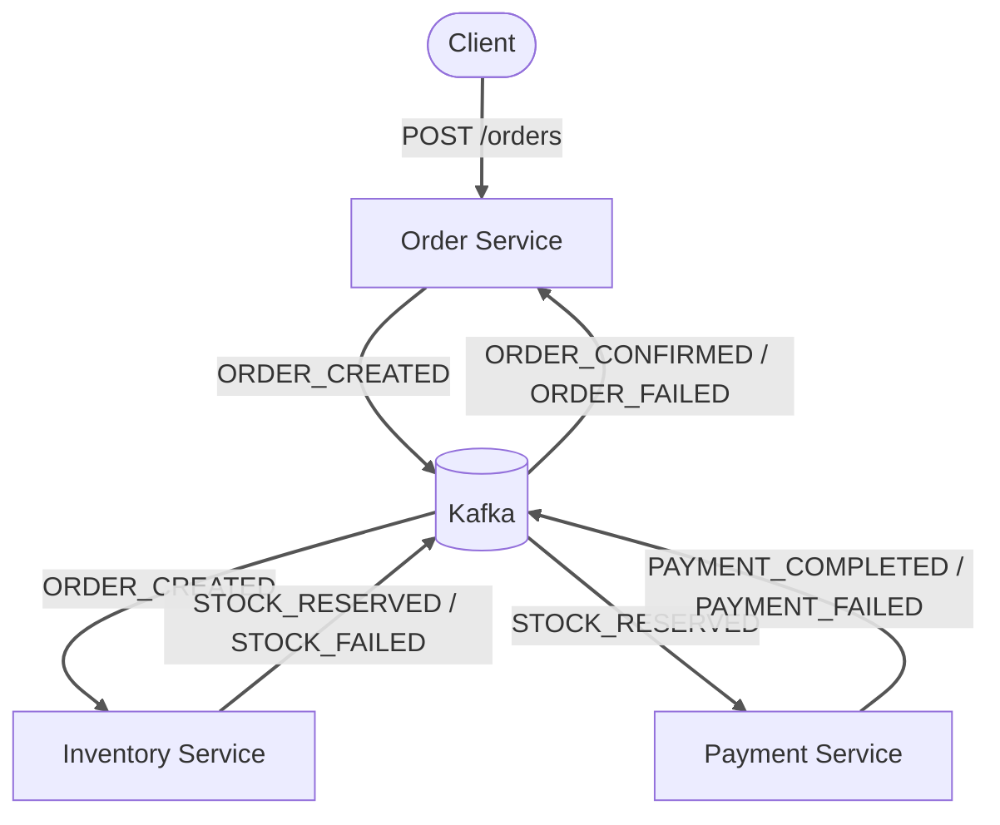
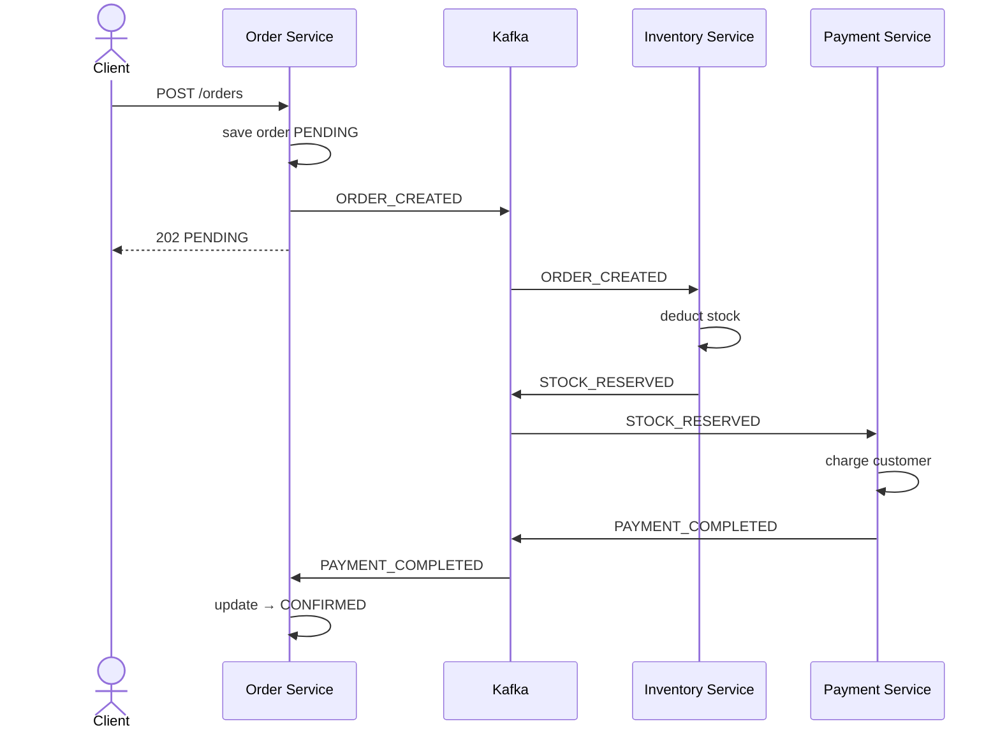
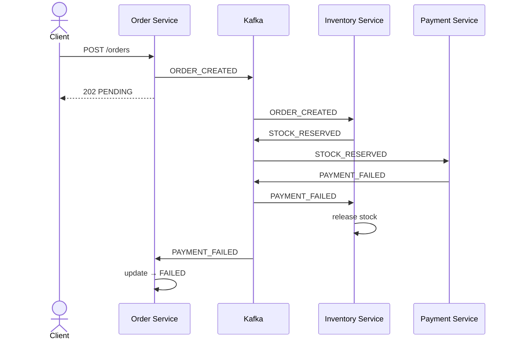
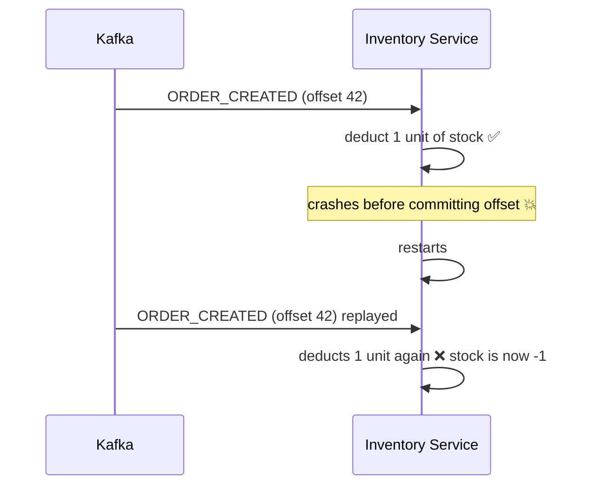
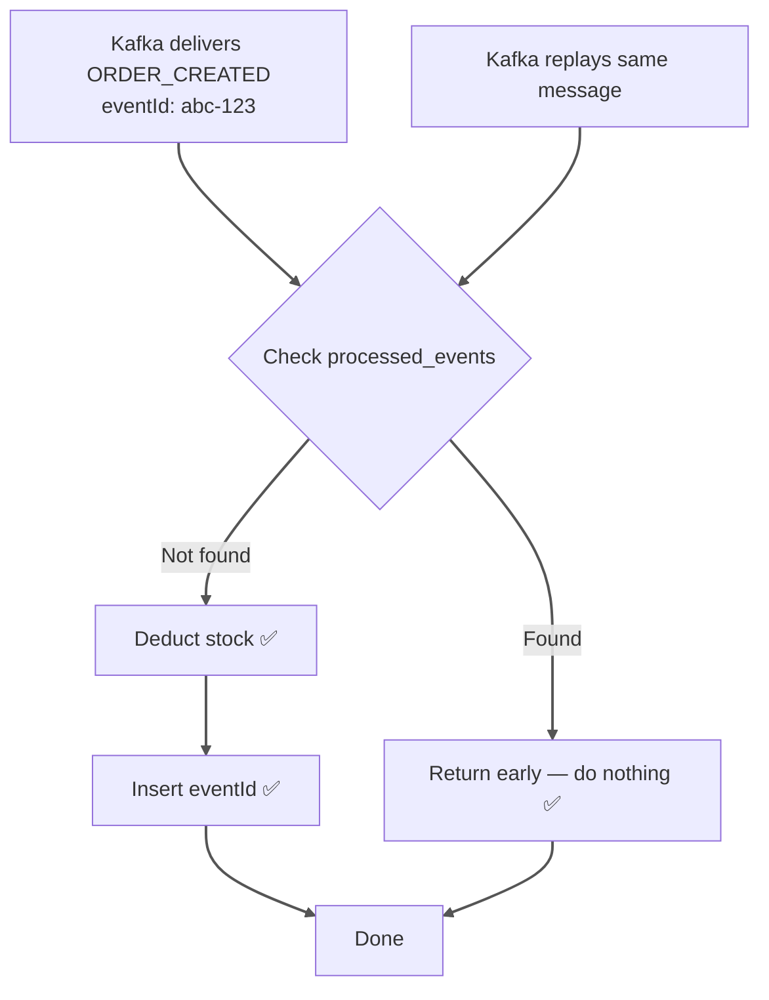

# Phase 2 — Kafka Async + Idempotent Consumers

> Part of the [Distributed Order Processing System](https://github.com/mahmoodiftee/Distributed-Order-Processing-System)
> Full project: [`main`](https://github.com/mahmoodiftee/Distributed-Order-Processing-System/tree/main) | Phase 1: [`phase/1-http-synchronous`](https://github.com/mahmoodiftee/Distributed-Order-Processing-System/tree/phase/1-http-synchronous) | Phase 3: [`phase/3-saga-orchestration`](https://github.com/mahmoodiftee/Distributed-Order-Processing-System/tree/phase/3-saga-orchestration)

---

## The Problem Phase 1 Left Behind

In Phase 1, services called each other directly over HTTP. Every service had to be alive at the exact same moment for anything to work.



This is called **tight coupling** — one service going down takes the entire flow with it. This is one of the most common ways distributed systems fail in production.

---

## The Solution — Kafka as the Event Bus

Instead of calling each other directly, services communicate through Kafka. A service emits an event and walks away. It doesn't wait. It doesn't care who picks it up or when.



Now if Inventory Service goes down mid-deployment, Kafka holds the messages. When it comes back up it processes them automatically. No orders are lost. No manual intervention needed.

---

## Event Flow

**Happy path:**



The client gets a response immediately — before the order is even processed. This is how real e-commerce works. You place an order, get a confirmation number, and the system processes it in the background.

**Failure path:**



---

## Kafka Topics

| Topic | Emitted By | Consumed By |
|---|---|---|
| `order.created` | Order Service | Inventory Service |
| `stock.reserved` | Inventory Service | Payment Service |
| `stock.failed` | Inventory Service | Order Service |
| `payment.completed` | Payment Service | Order Service |
| `payment.failed` | Payment Service | Order Service, Inventory Service |

---

## Consumer Groups — Why They Matter

Every service declares a `groupId` when connecting to Kafka:

```typescript
consumer: {
  groupId: 'inventory-service-consumer'
}
```

Kafka uses this to track which messages each service has processed. If you run two instances of Inventory Service they share the same `groupId` — Kafka splits the work between them and each message is processed by exactly one instance.

If they had different group IDs, both instances would process every message — every order would deduct stock twice.

---

## The New Problem Kafka Introduces

Kafka guarantees **at-least-once delivery**. The same message can arrive more than once. It happens when a consumer processes a message but crashes before committing its offset — Kafka replays the message on restart.

Without protection this causes real damage:



This is the **duplicate processing problem** — one of the most common bugs in event-driven systems.

---

## The Solution — Idempotent Consumers

An idempotent operation is one where making the same request multiple times has the same effect as making it once.

Every service has a `processed_events` table:

```sql
id        uuid
eventId   text  UNIQUE
topic     text
createdAt timestamp
```

Before processing any Kafka message every consumer checks this table:

```typescript
async handleOrderCreated(event: OrderCreatedEvent, eventId: string) {
  const seen = await this.prisma.processedEvent.findUnique({
    where: { eventId }
  });

  if (seen) {
    return; // duplicate — silently ignore
  }

  // first time seeing this event — safe to process
  await this.reserveStock(event);

  await this.prisma.processedEvent.create({
    data: { eventId, topic: 'order.created' }
  });
}
```

The `UNIQUE` constraint on `eventId` is the real safety net. Even if two instances race to insert the same `eventId`, the database rejects the second one. The guarantee is enforced at the storage level — not just in application code.

**What idempotency looks like in practice:**



The second delivery has zero effect. That's idempotency.

---

## Running This Branch

```bash
git clone https://github.com/mahmoodiftee/Distributed-Order-Processing-System.git
cd Distributed-Order-Processing-System
git checkout phase/2-kafka-async

pnpm install
docker compose up -d

# Three separate terminals
pnpm --filter order-service dev
pnpm --filter inventory-service dev
pnpm --filter payment-service dev
```

**Place an order:**

```bash
curl -X POST http://localhost:3001/orders \
  -H "Content-Type: application/json" \
  -d '{
    "customerId": "customer-1",
    "productId": "product-1",
    "quantity": 1,
    "totalAmount": 999.99
  }'
```

**Test resilience — kill Inventory Service, place an order, restart it:**

```bash
# 1. Kill inventory service (Ctrl+C in its terminal)
# 2. Place an order — Order Service still accepts it and returns 202
# 3. Restart inventory service
# 4. Watch it automatically process the queued message
```

---

## What This Phase Teaches

Kafka doesn't just solve availability — it changes how you think about service communication. Instead of "call this service and wait for a response", you think "emit this event and trust the system to handle it". That mental shift is what makes distributed systems actually distributed rather than just microservices pretending to be independent.

Idempotency is not an optimization. In any system with at-least-once delivery it is a correctness requirement. A consumer that processes the same message twice and produces different side effects is a broken consumer.

The limitation this phase leaves behind: services still coordinate by reacting to each other's events with no central component that knows the full transaction state. If a service crashes mid-flow nobody knows what happened or what needs to be undone. That's the problem Phase 3 solves.
