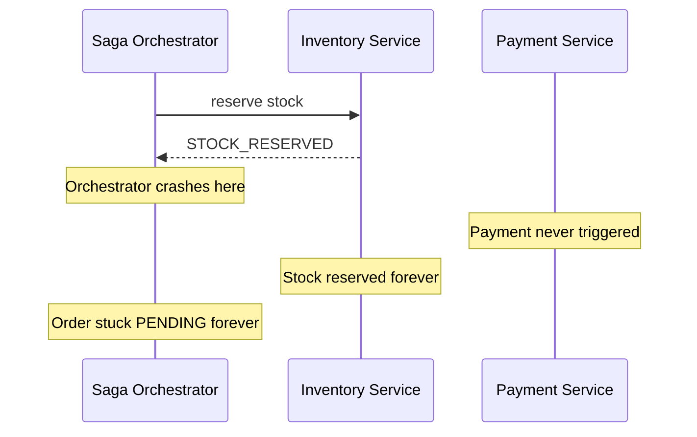
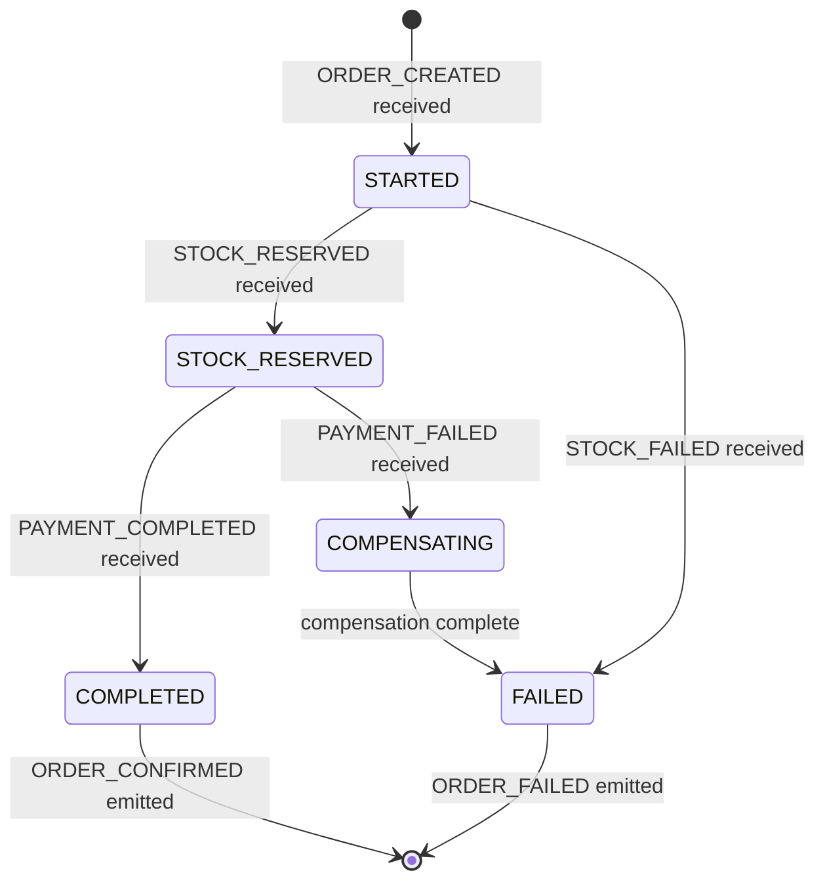
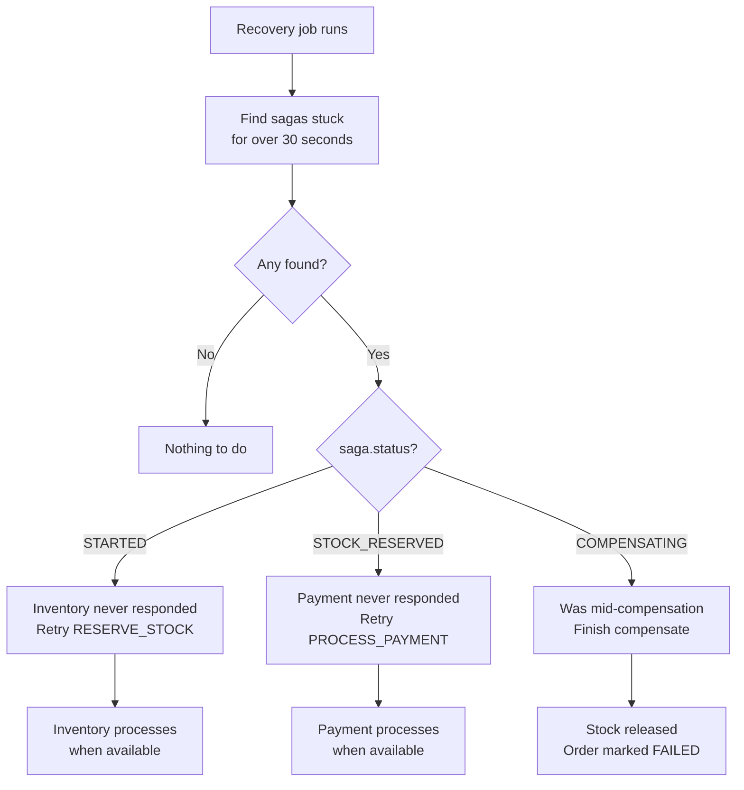
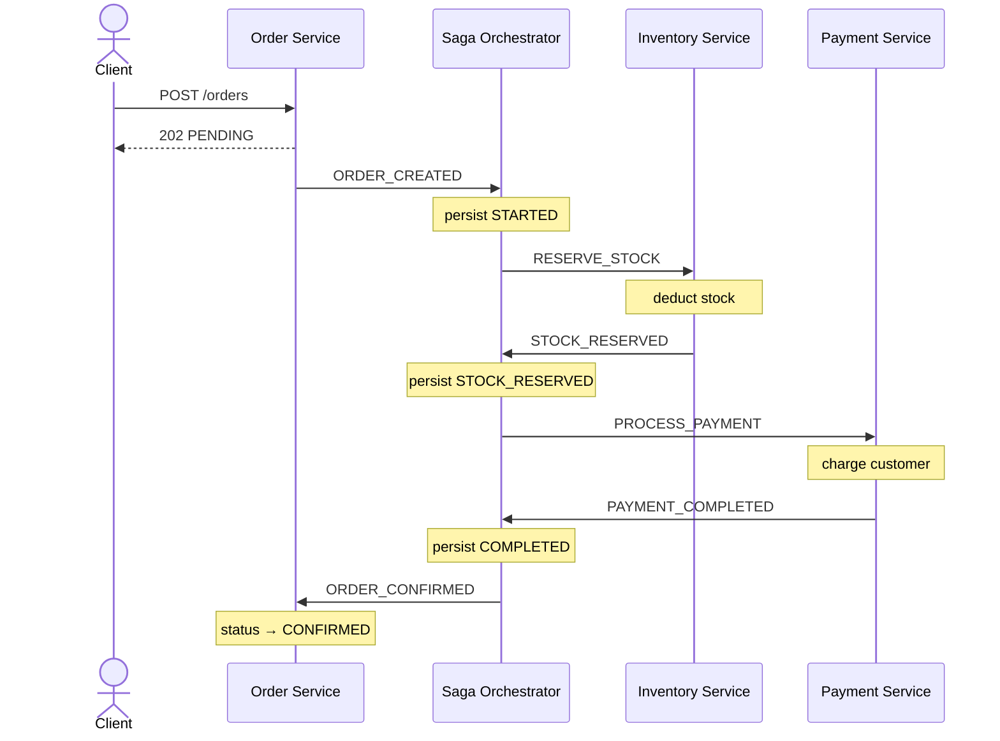
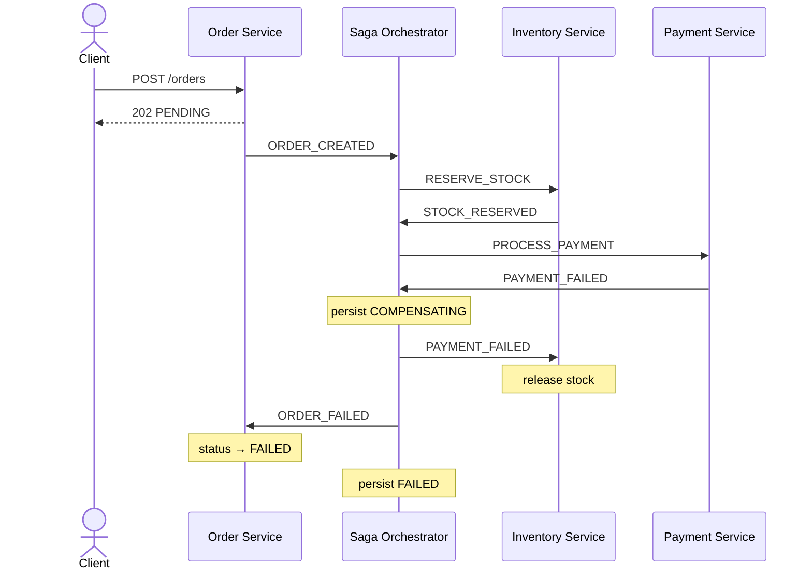
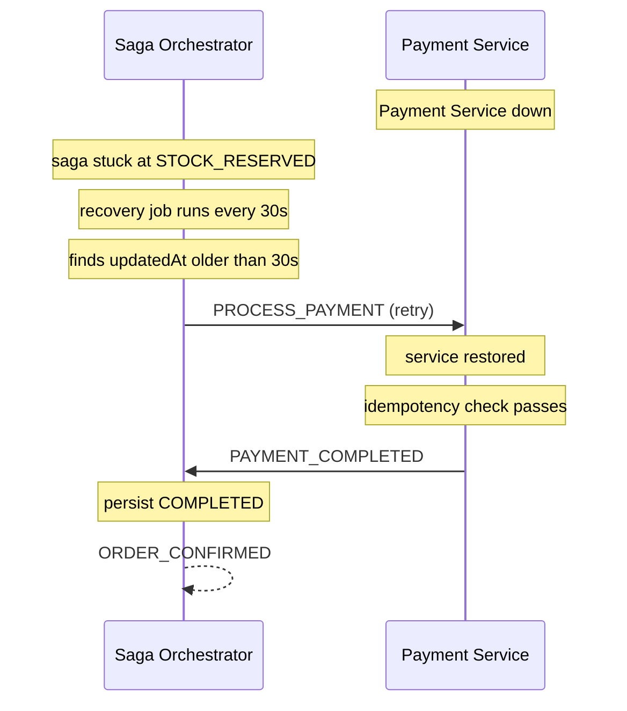

# Phase 3 — Saga Orchestration + Crash Recovery

> Part of the [Distributed Order Processing System](https://github.com/mahmoodiftee/Distributed-Order-Processing-System)
> Full project: [`main`](https://github.com/mahmoodiftee/Distributed-Order-Processing-System/tree/main) | Phase 1: [`phase/1-http-synchronous`](https://github.com/mahmoodiftee/Distributed-Order-Processing-System/tree/phase/1-http-synchronous) | Phase 2: [`phase/2-kafka-async`](https://github.com/mahmoodiftee/Distributed-Order-Processing-System/tree/phase/2-kafka-async)

---

## The Problem Phase 2 Left Behind

Phase 2 made services resilient to each other going down. But it introduced a new problem — what happens when the orchestrating service crashes _mid-transaction_?



This is called an **orphaned saga** — a distributed transaction that started but never finished and has no recovery plan. The longer your system runs, the more orphaned sagas accumulate. Data becomes permanently inconsistent.

---

## What a Saga Is

A saga is a pattern for managing a multi-step distributed transaction where each step can fail and needs to be undone if something goes wrong.

There are two styles:

**Choreography** — services react to each other's events and coordinate themselves. Simple but hard to track and impossible to recover from a crash.

**Orchestration** — one dedicated component knows the entire flow, tells each service what to do next, and handles failures explicitly. This is what Phase 3 implements.

```
Choreography = everyone improvises and hopes it works out
Orchestration = one conductor coordinates everyone
```

---

## The Saga Orchestrator

A dedicated `saga-orchestrator` service owns the full transaction lifecycle. It listens to events, decides what happens next, and — most importantly — persists its state to the database before every action it takes.

### Saga State Machine



### The Saga Table

```sql
id            uuid
orderId       text  UNIQUE
status        STARTED | COMPLETED | COMPENSATING | FAILED
currentStep   RESERVING_STOCK | CHARGING_PAYMENT | CONFIRMING_ORDER | RELEASING_STOCK | DONE
failureReason text nullable
createdAt     timestamp
updatedAt     timestamp
```

Every status and every step means something specific:

- `STARTED` — transaction is in progress
- `COMPLETED` — everything succeeded, saga is done
- `COMPENSATING` — something failed, currently undoing previous steps
- `FAILED` — compensation is complete, saga is permanently dead

---

## The Core Insight — Write Before Acting

This is the single most important pattern in this codebase:

```typescript
// WRONG — if crash happens here, we lost our place
await chargePayment(orderId);
await saga.update({ currentStep: "CHARGING_PAYMENT" });

// RIGHT — if crash happens after write, recovery knows exactly where we were
await saga.update({ currentStep: "CHARGING_PAYMENT" });
await chargePayment(orderId);
```

By writing the step to the database _before_ executing it, a crash at any point leaves enough information in the database to know what was in progress and what needs to be undone.

---

## The Full Saga Flow

### Happy Path

```typescript
async handleOrderCreated(data: OrderCreatedEvent) {
  // 1. Persist saga state first
  await this.prisma.saga.upsert({
    where: { orderId: data.orderId },
    create: { orderId: data.orderId, status: 'STARTED', currentStep: 'RESERVING_STOCK', ... },
    update: {},
  });

  // 2. Command Inventory to reserve stock — Inventory does NOT listen to ORDER_CREATED
  await this.producer.send({
    topic: TOPICS.RESERVE_STOCK,
    messages: [{ key: data.orderId, value: JSON.stringify(data) }],
  });
}

async handleStockReserved(data: StockReservedEvent) {
  // 3. Persist step transition before acting
  await this.prisma.saga.update({
    where: { orderId: data.orderId },
    data: { status: 'STOCK_RESERVED', currentStep: 'CHARGING_PAYMENT' },
  });

  // 4. Command Payment to process — Payment does NOT listen to STOCK_RESERVED
  await this.producer.send({
    topic: TOPICS.PROCESS_PAYMENT,
    messages: [{ key: data.orderId, value: JSON.stringify({ orderId: data.orderId }) }],
  });
}

async handlePaymentCompleted(data: PaymentCompletedEvent) {
  // 5. Mark saga as completed
  await this.prisma.saga.update({
    where: { orderId: data.orderId },
    data: { status: 'COMPLETED', currentStep: 'DONE' },
  });

  // 6. Confirm the order
  await this.producer.send({
    topic: TOPICS.ORDER_CONFIRMED,
    messages: [{ key: data.orderId, value: JSON.stringify({ orderId: data.orderId }) }],
  });
}
```

### Failure Path — Compensation

```typescript
async handlePaymentFailed(data: PaymentFailedEvent) {
  // 1. Persist COMPENSATING before doing anything
  await this.prisma.saga.update({
    where: { orderId: data.orderId },
    data: { status: 'COMPENSATING', currentStep: 'RELEASING_STOCK', reason: data.reason },
  });

  // 2. Run compensation
  await this.compensate(data.orderId, data.reason);
}

private async compensate(orderId: string, reason: string) {
  // Tell Inventory to release reserved stock
  await this.producer.send({
    topic: TOPICS.PAYMENT_FAILED,
    messages: [{ key: orderId, value: JSON.stringify({ orderId, reason }) }],
  });

  // Tell Order Service the order failed
  await this.producer.send({
    topic: TOPICS.ORDER_FAILED,
    messages: [{ key: orderId, value: JSON.stringify({ orderId, reason }) }],
  });

  await this.prisma.saga.update({
    where: { orderId },
    data: { status: 'FAILED', currentStep: 'DONE' },
  });
}
```

---

## Crash Recovery — The Key Feature

On startup and every 30 seconds, the orchestrator queries for stuck sagas and handles them based on their current status. The `updatedAt` filter ensures only sagas with no activity for over 30 seconds are touched — not ones actively being processed.

```typescript
private async recoverSagas() {
  const stuck = await this.prisma.saga.findMany({
    where: {
      status: { in: ['STARTED', 'STOCK_RESERVED', 'COMPENSATING'] },
      updatedAt: { lt: new Date(Date.now() - 30_000) },
    },
  });

  for (const saga of stuck) {
    if (saga.status === 'STARTED') {
      // Inventory never responded — retry the command
      await this.producer.send({ topic: TOPICS.RESERVE_STOCK, ... });
    }

    if (saga.status === 'STOCK_RESERVED') {
      // Payment never responded — retry the command
      // Idempotency in Payment Service ensures no double charge
      await this.producer.send({ topic: TOPICS.PROCESS_PAYMENT, ... });
    }

    if (saga.status === 'COMPENSATING') {
      // Was mid-compensation when crashed — finish it
      await this.compensate(saga.orderId, saga.reason);
    }
  }
}
```

**Why retry instead of compensate for `STOCK_RESERVED`?** Because `STOCK_RESERVED` with no payment response means "we don't know why payment didn't respond" — the service may have simply been down. Compensating immediately would cancel valid orders unnecessarily. Only compensate when payment explicitly reports failure via `PAYMENT_FAILED`.

### Recovery in Action



### Event Flow — All Three Scenarios

**Happy path:**



**Failure path — business failure (bank declined / no stock):**



**Recovery path — technical failure (service was down):**



---

## Kafka Topics

| Topic               | Producer          | Consumer                             | Purpose                     |
| ------------------- | ----------------- | ------------------------------------ | --------------------------- |
| `order.created`     | Order Service     | Saga Orchestrator                    | New order placed            |
| `reserve.stock`     | Saga Orchestrator | Inventory Service                    | Command to reserve stock    |
| `stock.reserved`    | Inventory Service | Saga Orchestrator                    | Stock reserved successfully |
| `stock.failed`      | Inventory Service | Saga Orchestrator                    | Stock reservation failed    |
| `process.payment`   | Saga Orchestrator | Payment Service                      | Command to process payment  |
| `payment.completed` | Payment Service   | Saga Orchestrator                    | Payment successful          |
| `payment.failed`    | Payment Service   | Saga Orchestrator, Inventory Service | Payment failed              |
| `order.confirmed`   | Saga Orchestrator | Order Service                        | Mark order confirmed        |
| `order.failed`      | Saga Orchestrator | Order Service                        | Mark order failed           |

---

## Running This Branch

```bash
git clone https://github.com/mahmoodiftee/Distributed-Order-Processing-System.git
cd Distributed-Order-Processing-System
git checkout phase/3-saga-orchestration

pnpm install
docker compose up -d

# Four separate terminals
pnpm --filter order-service dev
pnpm --filter inventory-service dev
pnpm --filter payment-service dev
pnpm --filter saga-orchestrator dev
```

**Test business failure (payment declined):**

```bash
# Place orders — 10% failure rate built in
curl -X POST http://localhost:3001/orders \
  -H "Content-Type: application/json" \
  -d '{ "customerId": "customer-1", "productId": "product-1", "quantity": 1, "totalAmount": 999.99 }'

# Watch saga logs — on failure you will see:
# Payment FAILED → Saga persist COMPENSATING → stock released → ORDER_FAILED
```

**Test technical failure (service downtime):**

```bash
# 1. Start all services
# 2. Place an order
# 3. Kill payment service (Ctrl+C) after saga logs "commanded Payment to PROCESS_PAYMENT"
# 4. Wait 30 seconds
# 5. Watch saga recovery logs — it will retry PROCESS_PAYMENT automatically
# 6. Restart payment service — it will process the retried command
```

**Check all databases:**

```bash
# Orders
docker exec -it $(docker ps -qf "name=order-db") \
  psql -U postgres -d order_db -c "SELECT id, status FROM \"Order\";"

# Stock levels
docker exec -it $(docker ps -qf "name=inventory-db") \
  psql -U postgres -d inventory_db -c "SELECT name, stock FROM \"Product\";"

# Saga audit trail
docker exec -it $(docker ps -qf "name=saga-db") \
  psql -U postgres -d saga_db \
  -c "SELECT order_id, status, current_step, reason FROM \"Saga\";"
```

---

## What This Phase Teaches

A distributed transaction is only as reliable as its recovery story. The saga pattern forces you to think about every possible failure point and define explicitly what "undo" means for each step. Systems without this end up with inconsistent data that requires manual database fixes to resolve — something no production system can afford at scale.

The insight that separates this from naive implementations: **write your intent to durable storage before executing it**. That one discipline is what makes recovery possible at all.
