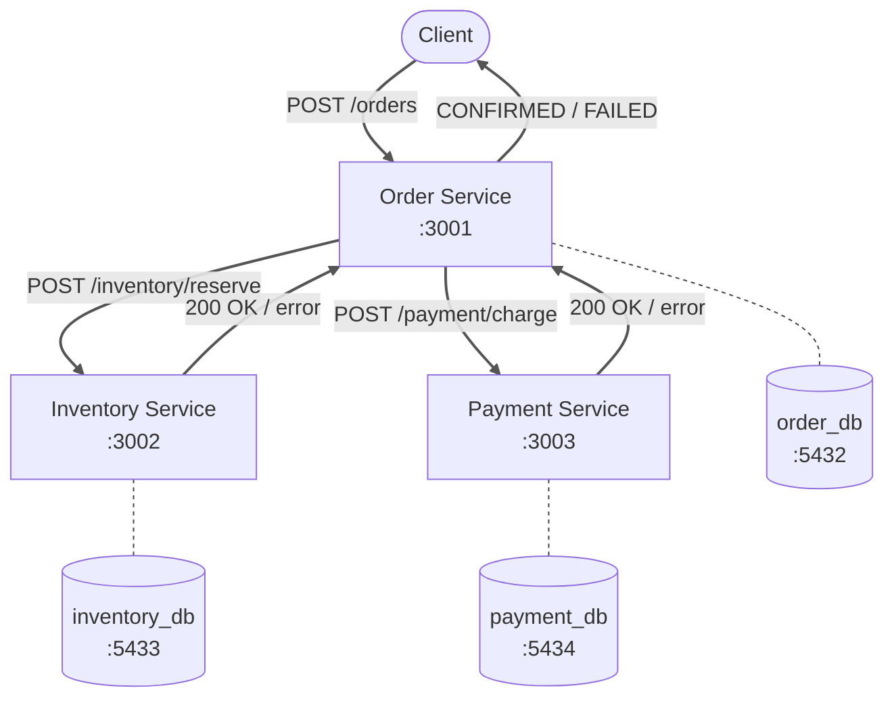
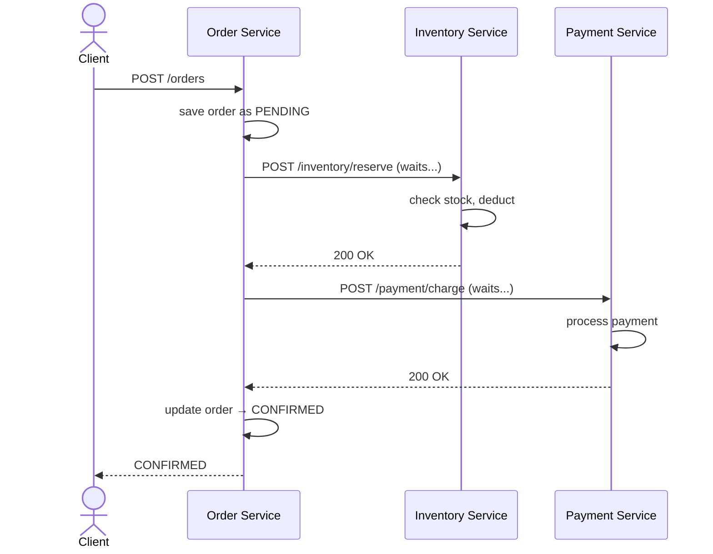
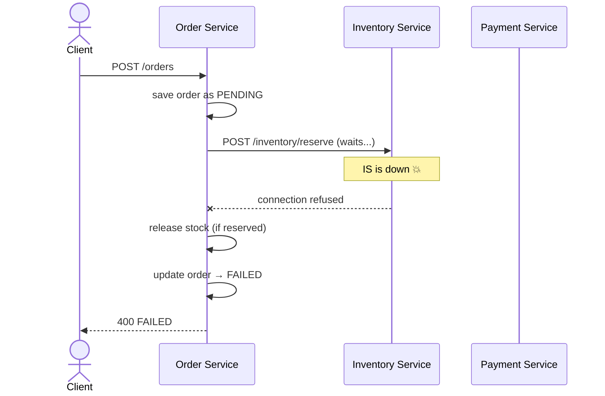

# Phase 1 — HTTP Synchronous Communication

> Part of the [Distributed Order Processing System](https://github.com/mahmoodiftee/Distributed-Order-Processing-System)
> Full project: [`main`](https://github.com/mahmoodiftee/Distributed-Order-Processing-System/tree/main) | Phase 2: [`phase/2-kafka-async`](https://github.com/mahmoodiftee/Distributed-Order-Processing-System/tree/phase/2-kafka-async) | Phase 3: [`phase/3-saga-orchestration`](https://github.com/mahmoodiftee/Distributed-Order-Processing-System/tree/phase/3-saga-orchestration)

---

## What This Phase Is

The simplest possible microservices implementation. Services call each other directly over HTTP — Order Service calls Inventory Service, waits for a response, then calls Payment Service, waits again, then returns the final result to the client.

No Kafka. No sagas. No async. Just three services talking directly to each other.

This phase exists to make you feel the problem before introducing the solution.

---

## Architecture



Each service still owns its own database — that discipline carries through all three phases.

---

## Request Flow



The client waits for the entire flow to complete before getting a response. Every service must be alive and responsive for the order to succeed.

---

## Failure Flow



If any service in the chain is down — even for a 30 second deployment — every order placed during that window fails immediately. The client gets an error. The order is lost.

---

## The Code

Order Service calls Inventory and Payment directly:

```typescript
async createOrder(dto: CreateOrderDto) {
  // Save order as PENDING first
  const order = await this.prisma.order.create({
    data: { ...dto, status: 'PENDING' },
  });

  try {
    // Synchronous HTTP call — waits for response
    await this.reserveStock(order.id, dto.productId, dto.quantity);

    // Synchronous HTTP call — waits for response
    await this.chargePayment(order.id, dto.customerId, dto.totalAmount);

    // Only reaches here if both calls succeeded
    return await this.prisma.order.update({
      where: { id: order.id },
      data: { status: 'CONFIRMED' },
    });

  } catch (error) {
    // One of the services failed — roll back what we can
    await this.releaseStock(order.id).catch(() => {});
    await this.prisma.order.update({
      where: { id: order.id },
      data: { status: 'FAILED' },
    });
    throw error;
  }
}

private async reserveStock(orderId: string, productId: string, quantity: number) {
  const response = await fetch('http://localhost:3002/inventory/reserve', {
    method: 'POST',
    headers: { 'Content-Type': 'application/json' },
    body: JSON.stringify({ orderId, productId, quantity }),
  });

  if (!response.ok) throw new Error('Stock reservation failed');
}

private async chargePayment(orderId: string, customerId: string, amount: number) {
  const response = await fetch('http://localhost:3003/payment/charge', {
    method: 'POST',
    headers: { 'Content-Type': 'application/json' },
    body: JSON.stringify({ orderId, customerId, amount }),
  });

  if (!response.ok) throw new Error('Payment failed');
}
```

Simple and readable — but every line of this is a dependency on another service being alive right now.

---

## Services

| Service | Port | Database | Responsibility |
|---|---|---|---|
| Order Service | 3001 | order_db :5432 | Creates and tracks orders |
| Inventory Service | 3002 | inventory_db :5433 | Manages product stock |
| Payment Service | 3003 | payment_db :5434 | Processes payments |

---

## Running This Branch

```bash
git clone https://github.com/mahmoodiftee/Distributed-Order-Processing-System.git
cd Distributed-Order-Processing-System
git checkout phase/1-http-synchronous

pnpm install
docker compose up -d

# Three separate terminals
pnpm --filter order-service dev
pnpm --filter inventory-service dev
pnpm --filter payment-service dev
```

**Place an order:**

```bash
curl -X POST http://localhost:3001/orders \
  -H "Content-Type: application/json" \
  -d '{
    "customerId": "customer-1",
    "productId": "product-1",
    "quantity": 1,
    "totalAmount": 999.99
  }'
```

**Test the failure scenario — kill Inventory Service then place an order:**

```bash
# Kill inventory service (Ctrl+C in its terminal)
# Place an order — you will get an immediate error
# Order status in DB will be FAILED
# Restart inventory service — no recovery, that order is gone
```

**Check the database:**

```bash
docker exec -it $(docker ps -qf "name=order-db") \
  psql -U postgres -d order_db -c "SELECT id, status FROM \"Order\";"
```

---

## The Problem This Phase Reveals

**Tight coupling.** Every service must be running for any order to succeed. In production, services restart for deployments, crash under load, and have network hiccups. With this architecture, any of those events during peak traffic means lost orders.

**No resilience.** There is no retry, no queue, no recovery. If a call fails, the order fails. Forever.

**Synchronous bottleneck.** The client waits for the entire chain. A slow payment provider makes every order slow. A slow inventory check blocks the payment call.

These are not hypothetical problems — they are the exact failures that pushed the industry toward event-driven architecture. Phase 2 solves all three by introducing Kafka.

---

## What This Phase Teaches

Sometimes the best way to understand a solution is to build the problem first. Every limitation in this phase has a specific name — tight coupling, synchronous blocking, no fault tolerance — and Phase 2 introduces exactly the right tool to solve each one.

If you understand why this phase breaks, you understand why Kafka exists.
